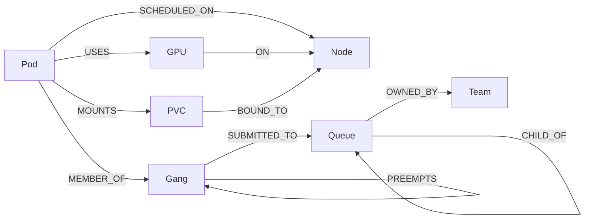
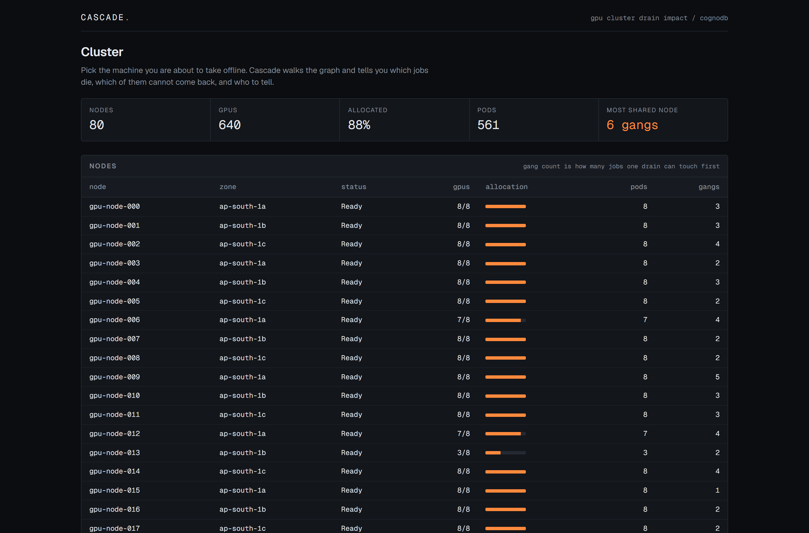
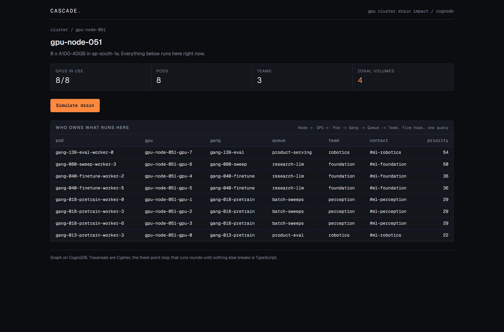
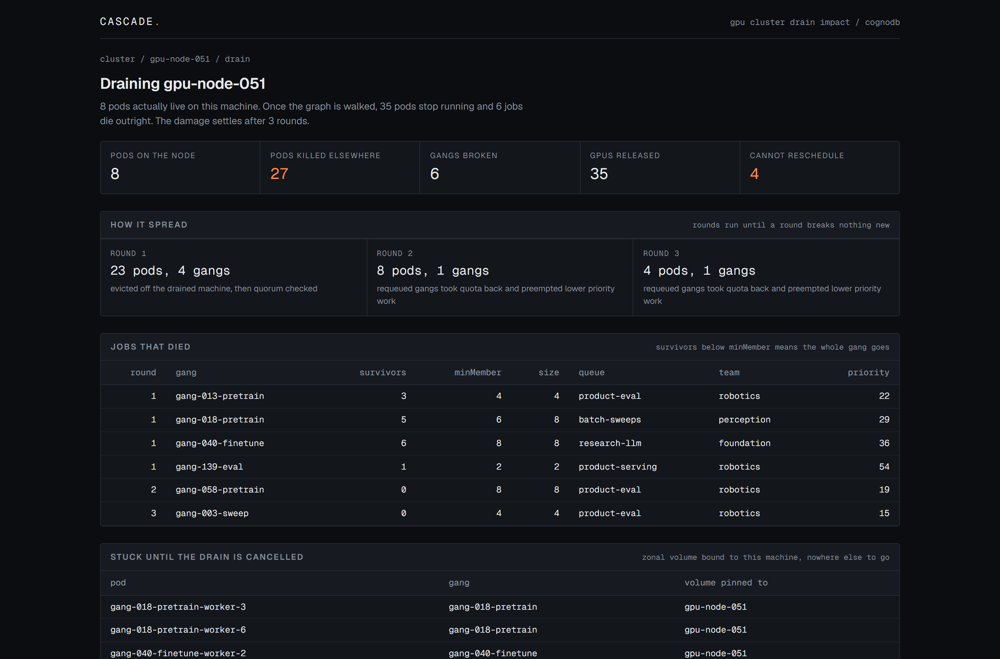

# Cascade

A drain-impact simulator for a gang-scheduled GPU cluster, built on CognoDB.

Pick the machine you are about to take offline. Cascade walks the graph and tells you which
jobs die, which of them cannot come back, and who to tell.

Live demo: TBD
Repo: TBD

## Why a graph database?

GPU training jobs are gang scheduled, which means all or nothing. A job with 8 workers needs
all 8 running at once, so losing a single worker kills the other 7. Those 7 release their GPUs,
the job goes back into its queue, it takes its quota back, and to make room the scheduler
preempts something lower priority somewhere else in the cluster. That job is also gang
scheduled, so it dies too, and the whole thing repeats.

The interesting part is that the damage does not stop at a fixed distance. How far it travels
depends on the shape of the relationships: how gangs are spread across machines, how deep the
queue tree is, who preempts whom. You cannot answer "what breaks if I drain gpu-node-042" by
counting rows. You have to follow edges until you stop finding new ones.

What this gains over a relational schema, concretely:

- The blast radius query has no fixed join depth. In SQL it is a recursive CTE per relationship
  type, rewritten every time the topology gains a level. Here it is one variable-length pattern.
- Quota rolls up a queue tree whose depth is data, not schema. `[:CHILD_OF*0..]` does not care
  how deep it goes.
- The five-hop ownership question, "who do I page about this machine", is one pattern instead of
  four joins across two junction tables.
- Gang quorum needs a traversal and an aggregate over the traversal in the same breath. The
  graph gives me the membership set and the count together.

## Data model

| Label | Key properties |
| --- | --- |
| `Node` | `name`, `zone`, `status` |
| `GPU` | `id`, `model`, `index`, `allocated` |
| `Pod` | `name`, `namespace`, `phase` |
| `Gang` | `name`, `minMember`, `size`, `priority`, `kind` |
| `Queue` | `name`, `quota`, `tier` |
| `Team` | `name`, `contact` |
| `PVC` | `name`, `zonal`, `storageClass` |

As patterns:

    (:Pod)-[:SCHEDULED_ON]->(:Node)
    (:Pod)-[:USES]->(:GPU)-[:ON]->(:Node)
    (:Pod)-[:MEMBER_OF]->(:Gang)          Gang is a PodGroup, carries minMember
    (:Pod)-[:MOUNTS]->(:PVC)-[:BOUND_TO]->(:Node)
    (:Gang)-[:SUBMITTED_TO]->(:Queue)
    (:Queue)-[:CHILD_OF]->(:Queue)        hierarchy, variable depth
    (:Queue)-[:OWNED_BY]->(:Team)
    (:Gang)-[:PREEMPTS]->(:Gang)

`PVC BOUND_TO Node` is what makes some pods genuinely unreschedulable. A zonal volume pins its
pod to one machine, so when that machine drains the pod has nowhere to go. That is the line
between "restarts elsewhere in a minute" and "dead until you cancel the drain", and it is the
thing an on-call engineer actually wants to know.

Every query lives in `lib/queries.ts`. Nothing is built by string concatenation, all inputs are
passed as parameters.

## The four queries that earn the graph

**Multi-hop ownership**, five hops in one pattern. Answers "who owns what runs on this box".

    MATCH (n:Node {name: $node})<-[:ON]-(gpu:GPU)<-[:USES]-(p:Pod)
          -[:MEMBER_OF]->(g:Gang)-[:SUBMITTED_TO]->(q:Queue)-[:OWNED_BY]->(t:Team)

In SQL this is four joins plus two junction tables before you can answer a question an on-call
engineer asks in one breath.

**Gang quorum**, traversal and aggregate in the same breath. A gang dies when its surviving
members drop below `minMember`, so you need the membership set and a count over it at once.
`GANG_STATE` collects each gang with all of its members, their machines and their pinned
volumes in one round trip.

**Variable-depth quota rollup.** `(:Queue)-[:CHILD_OF*0..]->(:Queue)` rolls quota up a tree
whose depth is a property of the data, not of the schema. The SQL version is a recursive CTE
that has to be rewritten every time someone adds a level.

**Unbounded cascade.** Preemption chains have no known depth. The simulator keeps running
rounds until a round produces no new casualties.

## Where Cypher stops and TypeScript starts

Worth being straight about this. Every traversal is Cypher. The fixed-point loop that runs
rounds until nothing else breaks is TypeScript in `lib/simulate.ts`, about 90 lines, and it
calls parameterised queries round by round:

1. Evict every pod scheduled on the drained node.
2. For each affected gang, count survivors. Below `minMember`, the gang dies and its remaining
   pods go too.
3. Each dead gang requeues and preempts its targets, killing those gangs' pods.
4. Repeat from step 2 with the newly hit gangs. Stop when a round breaks nothing new.

A gang can only break once, so the loop terminates even when the preemption graph has a cycle.
There is a test for exactly that.

## Running it

First create the database. At https://console.cognodb.com/signup, sign up and create a free
`c0` instance in the region nearest you. It provisions in under a minute. You are given a
connection URI of the form `bolt+s://<instance-id>.databases.cognodb.cloud`, the username
`cognodb` and a generated password shown exactly once, so copy it straight into `.env.local`.

Then:

    npm install
    cp .env.example .env.local     # paste the three values from the console
    npm run seed
    npm run dev

`.env.local` needs three values, all from the CognoDB console, and it is gitignored:

    COGNODB_URI=bolt+s://db-xxxxxxxx.databases.cognodb.cloud
    COGNODB_USER=cognodb
    COGNODB_PASSWORD=

`GET /api/health` returns 200 when the database answers and 503 with the driver error when it
does not, which is the first thing to check if a page shows the setup notice.

## Screens

Three screens, each one answering the next question an on-call engineer asks.

**Cluster.** Every machine with its allocation, how many pods it carries and how many separate
jobs one drain would touch. Below it, the queue tree with quota rolled up through however many
levels the data has.

**Node.** What actually runs on this machine, resolved all the way out to the owning team, plus
the count of zonal volumes pinned here, which is the number that decides whether a drain is
routine or not.

**Drain.** The cascade. Pods that stop, jobs that die and why, which pods cannot restart
anywhere, and the list of teams to tell.

Empty, loading and error states are real screens, not afterthoughts: a drain that breaks nothing
says so, every route has a skeleton while the graph is being walked, and an unreachable database
renders a setup notice with the driver error and a pointer at `/api/health` instead of a stack
trace.

## The seed

`npm run seed` builds a deterministic cluster from a fixed RNG seed, so the demo is
reproducible and every run of the video shows the same numbers. `npm run seed -- --dry` prints
the shape without touching the database.

    80 nodes, 640 GPUs (561 allocated)
    122 gangs, 561 pods
    118 zonal volumes
    35 preemption edges
    9 queues in a two-level tree, 5 teams

That is roughly 1.5k nodes and 2.7k relationships, comfortably inside the free tier and big
enough that the cascades are not obvious by eye. Writes are `MERGE` based and batched, so the
script is safe to re-run.

## Tests

    npm test

Five tests over the cascade loop, run against an in-memory fixture rather than a live database,
so they are fast and deterministic: quorum, propagation depth, stranded pods, cycle termination
and the empty case.

## Deployment notes

Two decisions that were made up front rather than debugged later:

- Every route that touches the database sets `runtime = 'nodejs'`. Vercel's Edge runtime cannot
  open raw TCP sockets, so Bolt does not work there.
- The driver is a singleton on `globalThis`, not per request. The free tier caps connections at
  200 and serverless functions will happily exhaust that.

Fonts are self-hosted through the `geist` package so the build never depends on fetching from a
font CDN.

## Layout

    app/
      page.tsx              cluster overview and queue quota rollup
      node/[name]/page.tsx  node detail and the five-hop ownership query
      drain/[name]/page.tsx cascade result
      api/health/route.ts   database reachability
    lib/
      db.ts                 driver singleton, typed errors, int coercion
      queries.ts            every Cypher string, parameterised
      simulate.ts           the fixed-point loop
      simulate.test.ts
    scripts/
      seed.ts               deterministic generator
